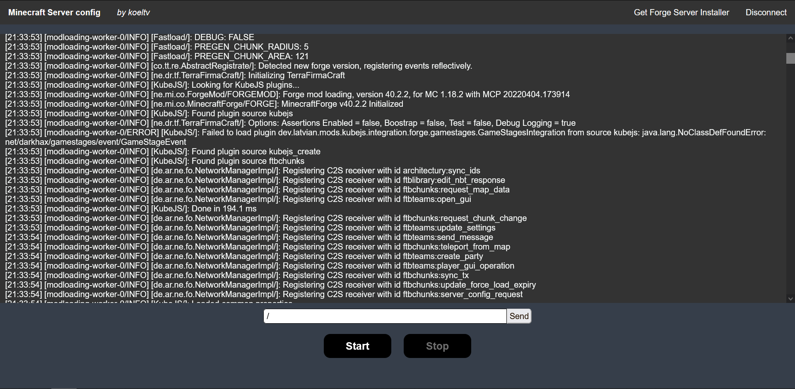

# Minecraft Server Web Interface

This web application is meant to be a secure way
to interact with and run a minecraft server through a web interface.


_Main interface, subject to changes_

## How to use

You first need to create your minecraft server folder.
To do that, go to the [Forge Website](https://files.minecraftforge.net/net/minecraftforge/forge/)
and download the `Installer` of the version you want.

Launch the `Installer`, select `Install server` and install it were you want.

Configure your server however you want, then download a [release](https://github.com/koeltv/minecraft-server/releases)
of this project.  
Once you have it, unzip it if necessary, then place your minecraft server in it in a directory called `server`.
You will have a directory similar to this:

```
.
└── minecraft-server-VERSION/
    ├── bin/
    ├── conf/
    ├── legal/
    ├── lib/
    ├── server/ <-- Your minecraft server here/
    │   ├── config/
    │   ├── mods/
    │   ├── server.properties
    │   └── ...
    ├── minecraft-server
    └── minecraft-server.bat
```

Then you can simply launch the application using either `minecraft-server.bat` or `minecraft-server` depending on your
platform (`.bat` for Windows, ...)

You can then access the interface via your navigator (port 80 by default). The default login and password is 'admin'.

From here, start your minecraft server and pass it commands if you want.

## Deployment

You can use the [associated docker image](https://github.com/koeltv/minecraft-server/pkgs/container/minecraft-server)
like so:

```shell
docker pull ghcr.io/koeltv/minecraft-server:latest
```

To use it, you will need to transfer the minecraft server files to it or attach a volume. The latter can be done using
a `docker-compose.yml` file:

```yaml
version: '3.9'

services:
  minecraft-server:
    image: ghcr.io/koeltv/minecraft-server:latest
    container_name: minecraft-server
    environment:
      - USER=admin
      - ROOT_PASSWORD=admin
    ports:
      - "80:80"
      - "25565:25565"
    volumes:
      - <YOUR_MINECRAFT_SERVER_PATH>:/minecraft-server/server
```

## Currently implemented

- Self-contained app (packaged with custom JRE)
- Login page
- Start & Stop server with minimalist feedback
- Show console output
- Handle commands

## To-do
- Allow server configuration (server.properties)
- Pass mods & config via local files
- Pass mods via online repository
- Import forge file (and cache ?)

## Resource

- [Minecraft Banner by iwen56](https://www.deviantart.com/iwen56/art/Banniere-minecraft-368139531)
- [Minecraft favicon created by Aldo Cervantes - Flaticon](https://www.flaticon.com/free-icons/minecraft)
- [Login Title font by Allison James](https://www.fontspace.com/minecraft-evenings-font-f17735)